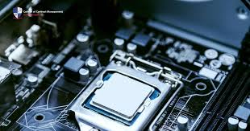
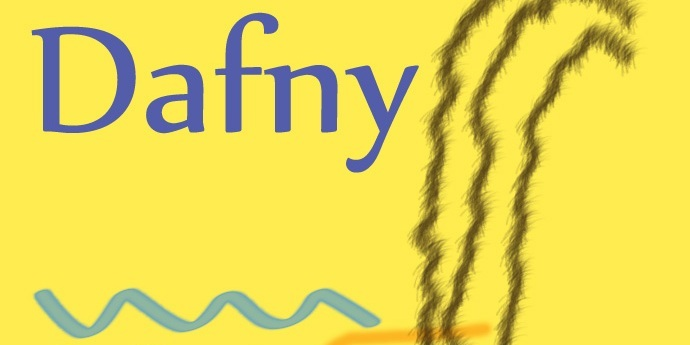
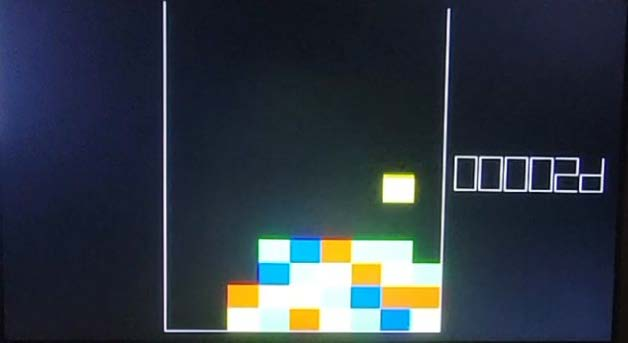
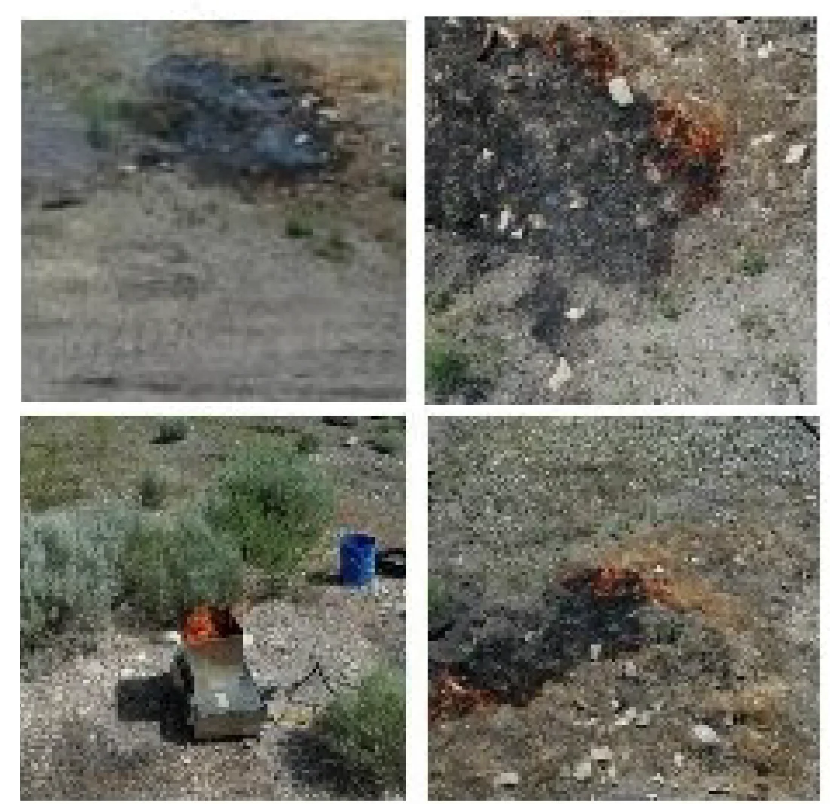
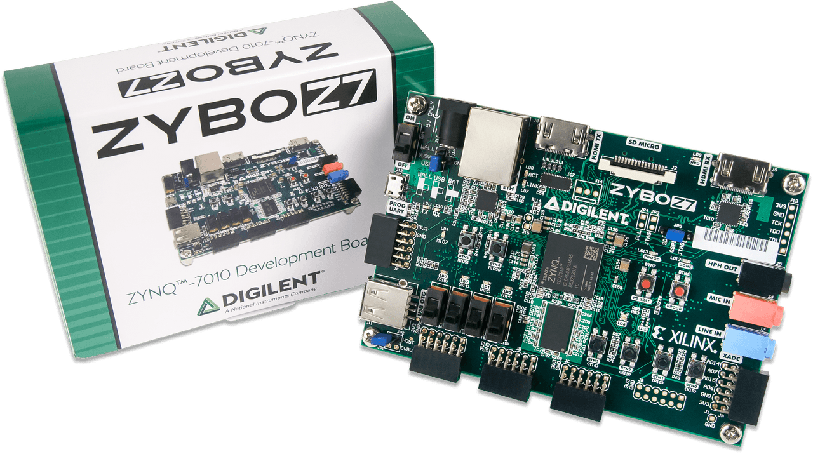
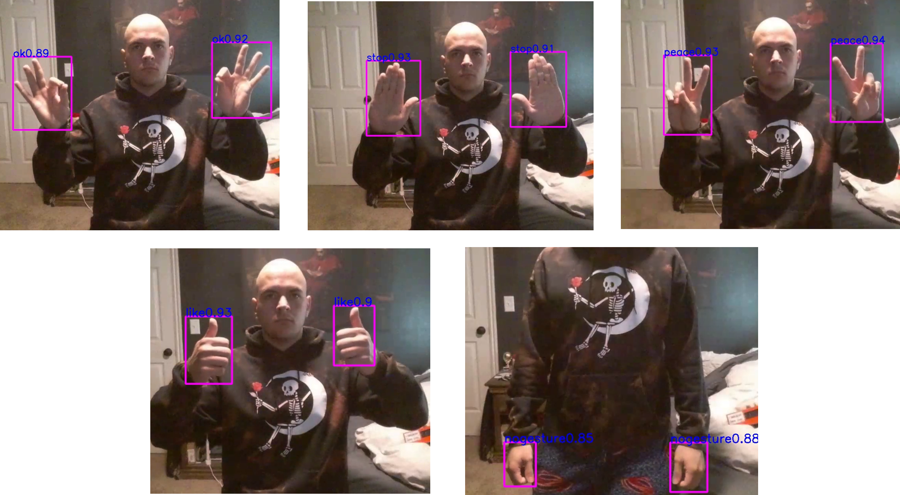

# Engineering Projects

Welcome to my project portfolio. My work spans from low-level digital logic and instruction set architectures to hardware-software co-design and contract-constrained software fuzzing. 

Choose a project below to explore the technical documentation, block diagrams, and source code.

-   

    ---

    **[5-Stage DLX Processor](dlx-processor/)**

    A 32-bit pipelined custom architecture featuring word-addressable instruction memory, a Hazard Detection Unit, and UART peripheral integration.

    `VHDL` `Python` `Assembly` `FPGA` `Questa`

-   

    ---

    **[Neural Network Verifier - Proofs in Dafny](verapak-proofs/)**

    Validating Python execution against Dafny models via a custom contract-constrained Atheris fuzzer to guarantee robustness.

    `Python` `Dafny` `Formal Verification`

-   

    ---

    **[Tetris FPGA Implementation](tetris/)**

    A real-time hardware game built on the DE10-Lite with a custom VGA controller, verified via Signal Tap logic analysis.

    `VHDL` `FPGA` `DE10-Lite` `VGA`

-   

    ---

    **[Autonomous Wind Turbine Fault Classification](turbine-fault-detection/)**

    Developing a diagnostic pipeline using supervised learning to classify structural and mechanical faults from high-frequency sensor data, optimizing for real-time detection accuracy.

    `Python` `Scikit-Learn` `Signal Processing` `Deep Learning` `Tensorflow` `UAV`

-   

    ---

    **[Autonomous Aerial Fire Detection System](fire-detection/)**

    Integrated deep learning models with UAV platforms to perform real-time wildfire identification and localization, utilizing RGB data for high-confidence detection.

    `Python` `Deep Learning` `Object Detection` `UAV Path Planning` `Edge AI`

-   

    ---

    **[Embedded IR-Remote Driver](embedded-IR-remote/)**

    A hardware/software co-design for IR demodulation on a Zybo Z7 FPGA using a MicroBlaze processor.

    `Verilog` `C` `MicroBlaze` `Zybo Z7`

-   

    ---

    **[Vision-Based Autonomous Drone Control](gesture-drone/)**

    An end-to-end autonomous UAV system utilizing real-time computer vision to map human hand gestures to flight maneuvers and command sequences.

    `Python` `OpenCV` `Computer Vision` `UAV Telemetry`

<!-- -   

    ---

    **[LED Digital Canvas](led-digital-canvas.md)**

    Hardware-software co-design utilizing an ESP32 to drive a 32x32 RGB matrix, housed in custom enclosures.

    `ESP32` `VHDL` `HW/SW Co-Design` `Fusion 360` -->

